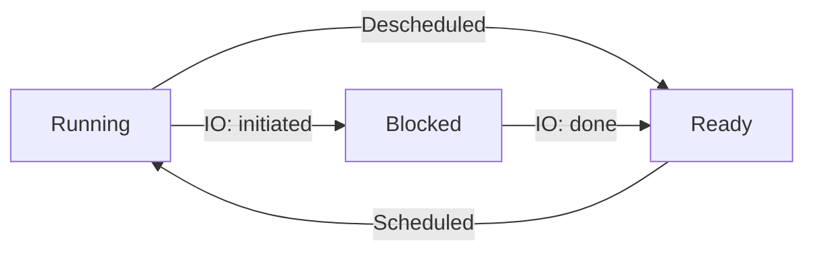

---
{"dg-publish":true,"permalink":"/zettelkasten/process-states/"}
---

At any given time, a process can be in any of the following states (simplified view):
* **Running.** A process is running on a [[zettelkasten/computer-processor\|processor]], i.e., it's executing instructions.
* **Ready.** A process is ready to run but for some reason the OS has chosen not to run it a this instance.
* **Blocked.** A process has some kind of operation that makes it not ready to run until some other event takes place. A common example: when a process initiates an IO request to a [[zettelkasten/disk\|disk]], the process blocks until the disk satisfy the process's request, and thus another process can use the processor.

### Processes only using the CPU

The following [[zettelkasten/gantt-chart\|Gantt chart]] show processes 0 and 1 transition through some of these states, both of which are running and are only using the CPU, i.e., they don't initiate any IO request:

```mermaid
gantt
title Tracing Process State: CPU Only
dateFormat X
axisFormat %s
section Process 0
Running : 0, 4
section Process 1
Ready : 0, 4
Running : 4,8
```

1. Process 0 runs for 4 units of time, while Process 1 is in the ready state waiting to be placed in the CPU.
2. Process 0 finishes running, and immediately Process 1 starts running and finishes 4 units of time later.
### Processes using the CPU and initiating IO requests

The following Gantt graph shows processes 0 and 1 but now process 0 initiates an IO request:

```mermaid
gantt
	title Tracing Process State: CPU and IO
	dateFormat X
	axisFormat %s
	section Process 0
	Running : 0, 3
	P0 initiates IO and blocks: 3
	Blocked : 3, 6
	P0 done with IO: 6
	Ready : 6, 8
	Running : 8, 10
	P0 now done: 10
	section Process 1
	Ready : 0, 3
	P1 starts running: 3
	Running: 3, 8
	Process 1 done: 8
```

1. At t0, Process 0 starts running while Process 1 is ready.
2. At t3, Process 0 initiates an IO request and blocks. At t3, P1 starts running.
3. At t6, P0 is done with IO request and now is ready. P1 is still running.
4. At t8, P1 finishes running and P0 starts running again.
5. At t10, P0 finishes running.